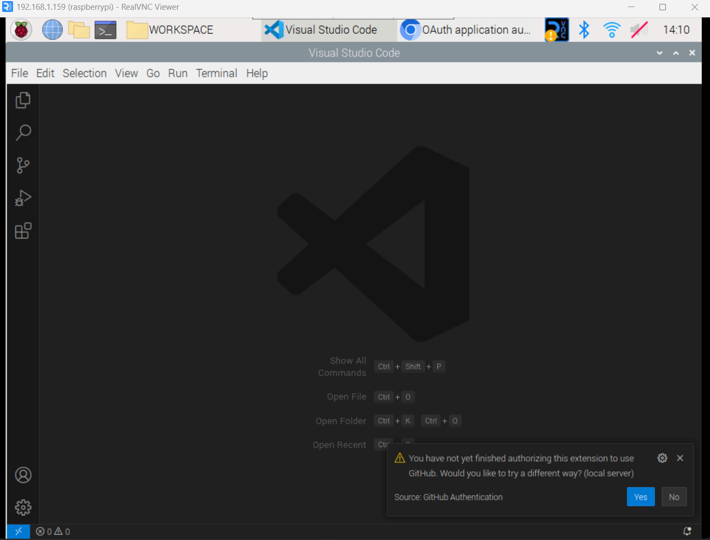
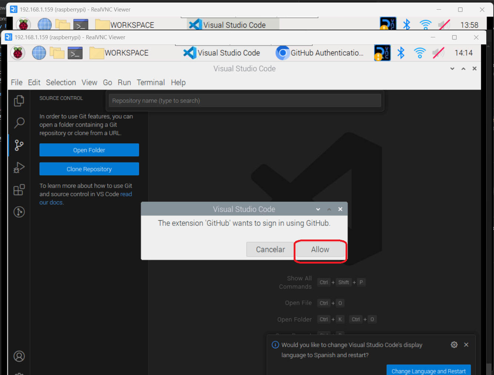
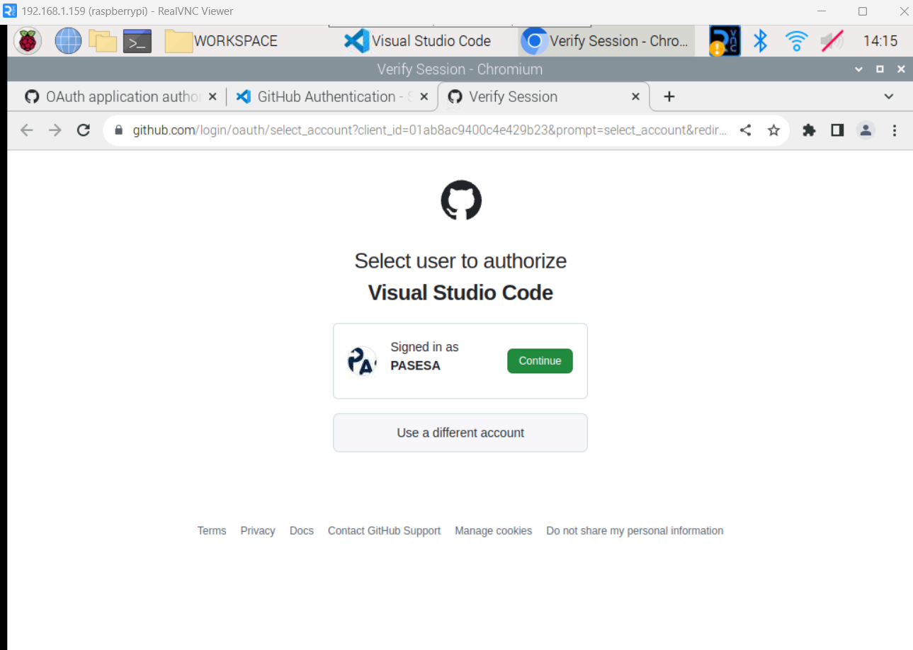

<h2>Menú</h2>

- [Instalación](#instalación)
  - [1. Instalación de Librerías del Sistema](#1-instalación-de-librerías-del-sistema)
  - [2. Instalación y Configuración de MariaDB](#2-instalación-y-configuración-de-mariadb)
  - [3. Creación de Usuario y Base de Datos](#3-creación-de-usuario-y-base-de-datos)
  - [4. Carga de Estructura Base de la Base de Datos](#4-carga-de-estructura-base-de-la-base-de-datos)
- [Configuración del Entorno de Desarrollo](#5-configuracion-del-entorno-de-desarrollo)

<h2 id="instalación">Instalación</h2>

<h3 id="1-instalación-de-librerías-del-sistema">1. Instalación de Librerías del Sistema</h3>

<p>Antes de instalar las librerías del sistema, es recomendable crear un entorno virtual para evitar conflictos de dependencias. Si no tienes instalado virtualenv, puedes hacerlo ejecutando el siguiente comando:</p>

<pre><code>pip3 install virtualenv</code></pre>

<p>Después de instalar virtualenv, crea un entorno virtual con el siguiente comando:</p>

<pre><code>python3 -m venv .venv</code></pre>

<p>Activa el entorno virtual. La forma de hacerlo varía según tu sistema operativo:</p>

<ul>
  <li>En Linux:</li>
  <pre><code>source .venv/bin/activate</code></pre>

<li>En Windows:</li>
  <pre><code>.venv\Scripts\activate</code></pre>
</ul>

<p>Una vez que el entorno virtual esté activado, puedes proceder con la instalación de las librerías del sistema:</p>

<pre><code>pip install -r requirements.txt</code></pre>

<p>Si surge algún error durante la instalación, instala manualmente cada librería según las especificaciones del archivo <code>requirements.txt</code> según la versión indicada con el comando:</p>

<pre><code>pip install nombre_libreria==version</code></pre>

<h3 id="2-instalación-y-configuración-de-mariadb">2. Instalación y Configuración de MariaDB</h3>

<p>Asegúrate de tener MariaDB instalado en tu sistema ejecutando el siguiente comando:</p>

<pre><code>sudo apt install mariadb-server</code></pre>

<p>Después, ejecuta el siguiente comando para realizar la configuración inicial siguiendo las instrucciones del asistente de instalación:</p>

<pre><code>sudo mysql_secure_installation</code></pre>

<h3 id="3-creación-de-usuario-y-base-de-datos">3. Creación de Usuario y Base de Datos</h3>

<p>Para crear un usuario para la base de datos y la base de datos, sigue los siguientes pasos:</p>

<pre><code>
-- Conéctate a MariaDB con las credenciales de la instalación
sudo mysql -uUsuario -pContraseña

-- Crea un usuario (reemplaza 'nombre_usuario' y 'contraseña' con tu elección)
CREATE USER 'nombre_usuario'@'localhost' IDENTIFIED BY 'contraseña';

-- Crea la base de datos
CREATE DATABASE nombre_base_de_datos;

-- Otorga permisos al usuario sobre la base de datos
GRANT ALL PRIVILEGES ON nombre_base_de_datos.* TO 'nombre_usuario'@'localhost';

-- Actualiza los privilegios
FLUSH PRIVILEGES;

-- Sal de MariaDB
exit;
</code></pre>

<p>Recuerda cambiar 'nombre_usuario' y 'contraseña' según tus preferencias de seguridad y configurar las credenciales correctamente para el funcionamiento del sistema.</p>

- **Recuerde guardar en un lugar seguro las credenciales, pues estas deberán ser configuradas dentro del panel de configuración del sistema**.

<h3 id="4-carga-de-estructura-base-de-la-base-de-datos">4. Carga de Estructura Base de la Base de Datos</h3>

<p>Para cargar la estructura base de la base de datos <code>DB\db_base.sql</code>, utiliza el siguiente comando:</p>

<pre><code>sudo mysql -unombre_usuario -pcontrasea nombre_base_de_datos < ./DB/db_base.sql</code></pre>

<p>Reemplaza 'nombre_usuario' con el nombre de usuario que creaste durante la configuración de la base de datos, así como la contraseña. Se te pedirá ingresar la contraseña del usuario.</p>

<h3 id="5-configuracion-del-entorno-de-desarrollo">5. Configuración del Entorno de Desarrollo</h3>

<p>El punto de entrada del sistema es el archivo <code>main.py</code>. Se recomienda utilizar Visual Studio Code (VS Code) para trabajar en el proyecto.</p>

<p>Para aprovechar las capacidades de depuración, se proporciona una configuración predefinida en el archivo <code>.vscode/launch.json</code>. Asegúrate de tener la extensión "Python" instalada en VS Code y utiliza esta configuración para facilitar el proceso de desarrollo y depuración del sistema.</p>


## 1. Configuración Inicial

En esta sección, se explica cómo añadir datos de configuración en un archivo de configuración por defecto en formato `.json`. Este archivo se utiliza para almacenar ajustes personalizados del sistema.

---

### Paso 1: Agregar nueva configuración al archivo de configuración

1. Dentro del archivo llamado `Config\default_config.json` define la estructura de la nueva configuración a añadir, considera que las configuraciones se agrupan por 

- general: almacena configuaciones correspondientes a imagenes del sitema, asi como formatos de fecha, tipos de fuentes y todo lo relacionado a la información de la interface
- tarifa: Guarda la información correspondiente a la tarifa del sistema, esta configuración no debe de ser modificada desde el archivo de configuración, si no desde dentro de la interface.
- promociones: almacena las promociones que son añadidas al sistema, asi como su configuración y como son aplciadas estas.
- funcionamiento_interno: guarda las credenciales utilizadas dentro del sistema asi como configuracines de pines.

Por ejemplo:

   ```json
  {
    "general": {
      "configuracion_sistema": {
        "impresora": {
          "idVendor": "04b8",
          "idProduct": "0201"
        },
        "resolucion": "1920x1080"
      },
      "version": "1.0.0"
    }
  }
   ```

## 2. Obtener Configuración con `get_config`

La función `get_config` se encuentra dentro de la clase `ConfigController` en el módulo `Controllers.ConfigController`. Esta función está diseñada para obtener valores de configuración del archivo JSON de manera segura y eficiente.

---

### Uso de la función `get_config`

La función **no debe modificarse**, ya que está optimizada para leer el archivo de configuración y manejar errores comunes. Solo debe usarse para obtener valores de configuración.

#### Ejemplo de uso de la función:
Instancia la clase para acceder a la función get_config:
```python
from Controllers.ConfigController import ConfigController

config_controller = ConfigController()

valor_configuracion = config_controller.get_config("general", "configuracion_sistema", "version")

print(valor_configuracion)  # Salida: "1.0.0"
  ```

## 3. Adición de vistas
- En caso de requerir añadir nuevas vistas, es decir añadir ventanas al sistema, estas deben de ser añadidas dentro de la carpeta `Views\`, el nombre debe de iniciar con el prefijo `View`.
- Declarar las variables acorde al tipo de dato que están almacenando.  

## 4. Detección y Registro de Cambios  
- Si se han añadido nuevas configuraciones, estas deben de ser registradas en el metodo de acuerdo al tipo de configuración, de igual manera tienen que añadirse validaciones para las nuevas configuraciones y por ultimo añadir las configuraciones en las funciones para limpiar los valores de la interface.
- Se recomienda seguir los ejemplos de las configuraciones ya existentes  

## 7. Reinicio de Configuración  
- Cerrar todo, eliminar la configuración del sistema y cargar la configuración por defecto para cargas las nuevas configuraciones, no olvidar configurar corerctamente las credenciales de las bases de datos.  

## 8. Pruebas  
- En caso de añadir nuevas funcionalidades, utilizar el archivo `test.py` para asegurar el correcto funcionamiento del sistema, posteriormente integrar cambios en el sistema dividiendo la logica del mismo.

## 9. Control de Versiones  
- **No hacer cambios directamente en la rama `main`**.  
- Utilizar únicamente la rama de desarrollo `dev`.
- Solo después de la validación de los cambios fusionar con `master`.  

## 10. Manejo de ramas
- **Siempre mantener actualizada la rama `main` con los ultimos cambios hechos en la rama de desarrollo**.

## 11. Consideraciones
- **Tener previamente instalado Visual Studio Code**.
- **Tener previamente configurado Git**.

para vincular VS code con Git, dar clic en la siguiente sección de la interface


dar clic en iniciar sesion


iniciar sesión con GitHub


Se abrirá una pestaña para iniciar sesión con GitHub, en casi de ser un dispositivo nuevo, enviará una notificación a su correo.


Seleccione su cuenta


De clic en abrir en visual studio para redireccionarnos a la aplicación


en caso de aparecer este mensaje, repetir los pasos anteriores


una vez se ha hecho corectamente, aparecera nuestra cuenta de github


## 12. Clonar repositorio

dar clic en el siguiente icono para clonar repositorio


seleccionar clonar dsede GitHub (esto accedera a nuestros repositorios)


Dar clic para iniciar sesión desde VS code en Github


Repetir los pasos anteriores


Seleccionar el repositorio correspondiente


Seleccionar la ubicación, es recomendable crear una carpeta aparte llamada `WORKSPACE`, esto tardara unos segundos


abrir el repositorio


Movernos de la rama `main` a `dev`, esto puede hacerlo desde la interface o comandos de Git


una vez dentro de dev, peuden comenzar a realizar su trabajo

