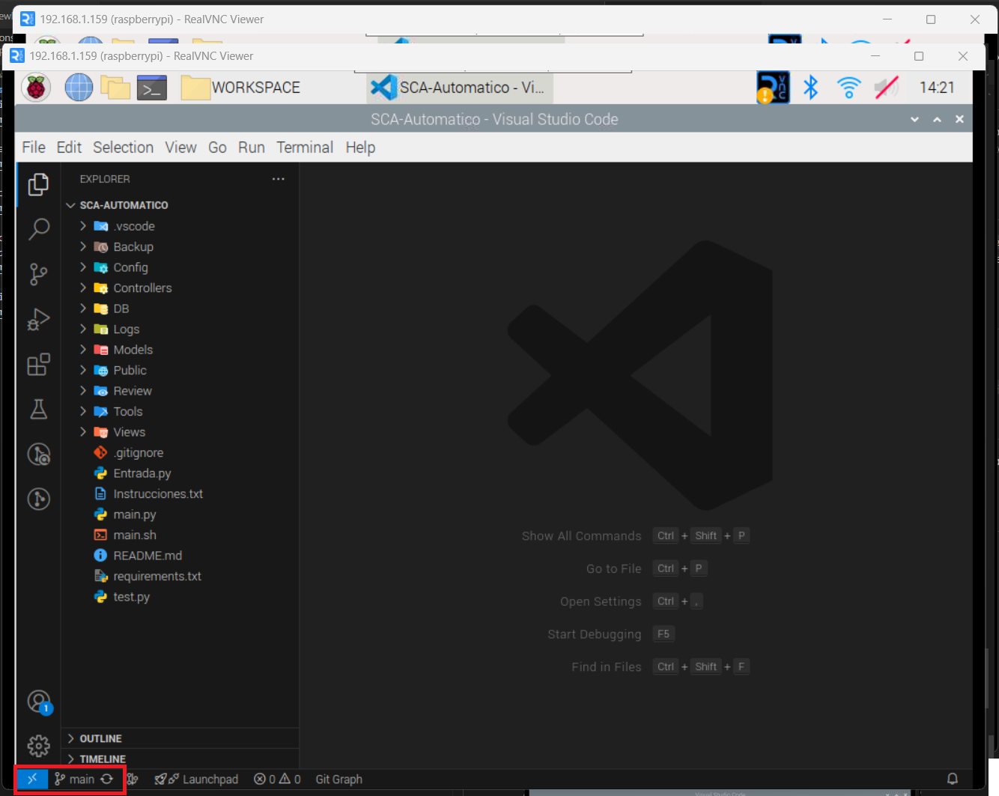

# Guía de Instalación y Uso

## Índice

1. [Configuración de VS Code con Git](#1-configuracion-de-vs-code-con-git)
2. [Descarga del Repositorio](#2-descarga-del-repositorio)
3. [Instalación de Dependencias](#3-instalacion-de-dependencias)
   - [Instalación de Librerías del Sistema](#31-instalacion-de-librerias-del-sistema)
   - [Instalación y Configuración de MariaDB](#32-instalacion-y-configuracion-de-mariadb)
   - [Creación de Usuario y Base de Datos](#33-creacion-de-usuario-y-base-de-datos)
   - [Carga de la Estructura Base de la Base de Datos](#34-carga-de-la-estructura-base-de-la-base-de-datos)
4. [Instrucciones para añadir configuraciones extra](#4-instrucciones-de-uso)
   - [Configuración Inicial](#41-configuracion-inicial)
   - [Obtención de Configuración con `get_config`](#42-obtencion-de-configuracion-con-get_config)
   - [Adición de Vistas](#43-adicion-de-vistas)
   - [Detección y Registro de Cambios](#44-deteccion-y-registro-de-cambios)
   - [Reinicio de Configuración](#45-reinicio-de-configuracion)
   - [Pruebas](#46-pruebas)

---

## 1. Configuración de VS Code con Git

Para vincular VS Code con Git, sigue estos pasos:

1. Accede a la sección de control de versiones en la interfaz de VS Code.
   
2. Haz clic en "Iniciar sesión".
   
3. Inicia sesión con tu cuenta de GitHub.
   
4. Seleccione su cuenta
   
5. Se abrirá una pestaña para autenticarte en GitHub. Si es un dispositivo nuevo, recibirás una notificación en tu correo.
   iniciar sesión con GitHub!
   
6. Haz clic en "Abrir en Visual Studio" para redirigirte a la aplicación.
   
7. Si aparece un mensaje de error, repite los pasos anteriores.
8. Una vez configurado correctamente, tu cuenta de GitHub aparecerá vinculada en VS Code.
   

---

## 2. Descarga del Repositorio

Para clonar el repositorio, sigue estos pasos:

1. Abre Visual Studio Code (VS Code) y accede a la sección de control de versiones.
2. Haz clic en "Clonar repositorio".
   
3. Selecciona la opción "Clonar desde GitHub" y sigue los pasos de autenticación.
   
4. Selecciona el repositorio correspondiente.
   
5. Elige la ubicación en tu computadora (se recomienda una carpeta llamada `WORKSPACE`).
   
6. Una vez descargado, abre el repositorio en VS Code.
   
7. Cambia de la rama `main` a `dev` para comenzar a trabajar.
   dar clic en el siguiente icono para clonar repositorio




8. **No está permitido trabajar en master**

## 3. Instalación de Dependencias

### 3.1 Instalación de Librerías del Sistema

Antes de instalar las librerías, crea un entorno virtual para evitar conflictos de dependencias:

```sh
pip3 install virtualenv
python3 -m venv .venv
```

Activa el entorno virtual:

- **Linux:** `source .venv/bin/activate`
- **Windows:** `.venv\Scripts\activate`

Instala las dependencias del proyecto:

```sh
pip install -r requirements.txt
```

Si hay errores, instala las librerías manualmente:

```sh
pip install nombre_libreria==version
```

### 3.2 Instalación y Configuración de MariaDB

```sh
sudo apt install mariadb-server
sudo mysql_secure_installation
```

### 3.3 Creación de Usuario y Base de Datos

```sql
CREATE USER 'nombre_usuario'@'localhost' IDENTIFIED BY 'contraseña';
CREATE DATABASE nombre_base_de_datos;
GRANT ALL PRIVILEGES ON nombre_base_de_datos.* TO 'nombre_usuario'@'localhost';
FLUSH PRIVILEGES;
EXIT;
```

### 3.4 Carga de la Estructura Base de la Base de Datos

```sh
sudo mysql -u nombre_usuario -p nombre_base_de_datos < ./DB/db_base.sql
```

## 4. Instrucciones para añadir configuraciones extra

### 4.1 Configuración Inicial

En esta sección, se explica cómo añadir datos de configuración en un archivo de configuración por defecto en formato `.json`. Este archivo se utiliza para almacenar ajustes personalizados del sistema.

---

### Paso 1: Agregar nueva configuración al archivo de configuración

1. Dentro del archivo llamado `Config\default_config.json` define la estructura de la nueva configuración a añadir, considera que las configuraciones se agrupan por

- general: almacena configuaciones correspondientes a imagenes del sitema, asi como formatos de fecha, tipos de fuentes y todo lo relacionado a la información de la interface
- tarifa: Guarda la información correspondiente a la tarifa del sistema, esta configuración no debe de ser modificada desde el archivo de configuración, si no desde dentro de la interface.
- promociones: almacena las promociones que son añadidas al sistema, asi como su configuración y como son aplciadas estas.
- funcionamiento_interno: guarda las credenciales utilizadas dentro del sistema asi como configuracines de pines.

Por ejemplo:

```json
{
  "general": {
    "configuracion_sistema": {
      "impresora": {
        "idVendor": "04b8",
        "idProduct": "0201"
      },
      "resolucion": "1920x1080"
    },
    "version": "1.0.0"
  }
}
```

### 4.2 Obtención de Configuración con `get_config`

La función `get_config` se encuentra dentro de la clase `ConfigController` en el módulo `Controllers.ConfigController`. Esta función está diseñada para obtener valores de configuración del archivo JSON de manera segura y eficiente.

---

### Uso de la función `get_config`

La función **no debe modificarse**, ya que está optimizada para leer el archivo de configuración y manejar errores comunes. Solo debe usarse para obtener valores de configuración.

#### Ejemplo de uso de la función:

Instancia la clase para acceder a la función get_config:

```python
from Controllers.ConfigController import ConfigController

config_controller = ConfigController()
valor_configuracion = config_controller.get_config("general", "configuracion_sistema", "version")
print(valor_configuracion)  # "1.0.0"
```

### 4.3 Adición de Vistas

- Las vistas deben estar dentro de `Views\` y comenzar con `View`.

### 4.4 Detección y Registro de Cambios

- Si se han añadido nuevas configuraciones, estas deben de ser registradas en el metodo de acuerdo al tipo de configuración, de igual manera tienen que añadirse validaciones para las nuevas configuraciones y por ultimo añadir las configuraciones en las funciones para limpiar los valores de la interface.
- Se recomienda seguir los ejemplos de las configuraciones ya existentes

### 4.5 Reinicio de Configuración

Eliminar la configuración del sistema y cargar la configuración por defecto.

### 4.6 Pruebas

Probar nuevas funcionalidades con `test.py` antes de integrarlas al sistema.

---
